# Task 2: Posterior Distillation Sampling (PDS)

**Method:** PDS with `guidance_scale = 7.5` (fixed per assignment).  
**Evaluation:** CLIP ViT-B/32 (`eval.py`), scored against each **edit prompt**.  
**Overall CLIP score:** **0.326**

## Summary

| # | Source prompt | Edit prompt | CLIP |
|---|---------------|-------------|------|
| 1 | A red bus driving on a desert road | A yellow school bus driving on a desert road | 0.353 |
| 2 | a boat in a river | a golden boat in a river | 0.295 |
| 3 | A cabin surrounded by forests | A cabin surrounded by flowers | 0.320 |
| 4 | A church beside a lake | A church beside a lake at night | 0.355 |
| 5 | A villa close to the pool | A villa covered with ivy close to the pool | 0.275 |
| 6 | A castle next to a river | A rainbow castle next to a river | 0.351 |
| 7 | A burger on the table | A burger with lettuce on the table | 0.291 |
| 8 | A dog sitting on grass | A golden retriever sitting on grass | 0.324 |
| 9 | a cat sitting on a table | a wooden cat statue sitting on a table | 0.373 |
| 10 | A car on the road | A yellow sportscar on the road | 0.326 |

---

## Results

### 1. A red bus driving on a desert road → A yellow school bus driving on a desert road

**CLIP:** 0.353

| Source | Edited |
|--------|--------|
| 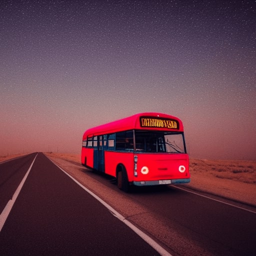 | 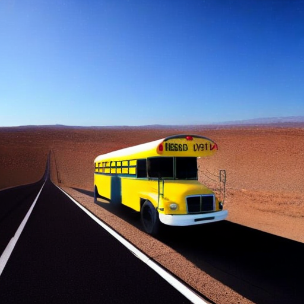 |

### 2. a boat in a river → a golden boat in a river

**CLIP:** 0.295

| Source | Edited |
|--------|--------|
| 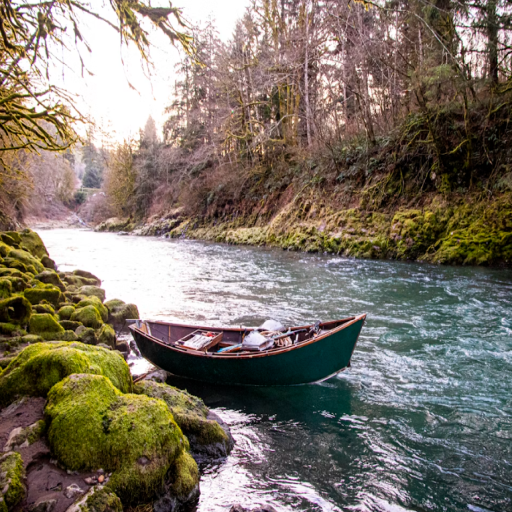 | 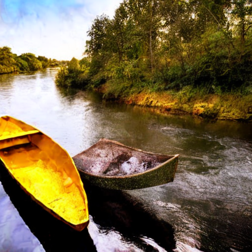 |

### 3. A cabin surrounded by forests → A cabin surrounded by flowers

**CLIP:** 0.320

| Source | Edited |
|--------|--------|
| 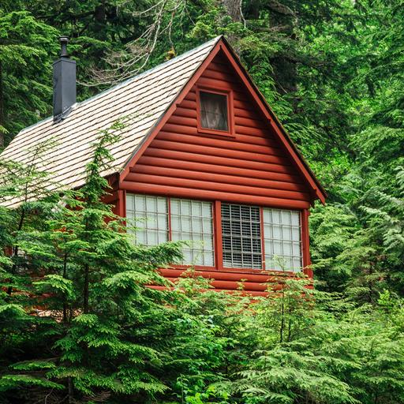 | 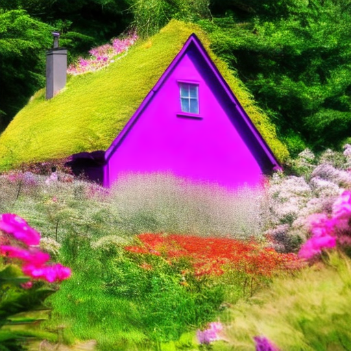 |

### 4. A church beside a lake → A church beside a lake at night

**CLIP:** 0.355

| Source | Edited |
|--------|--------|
| 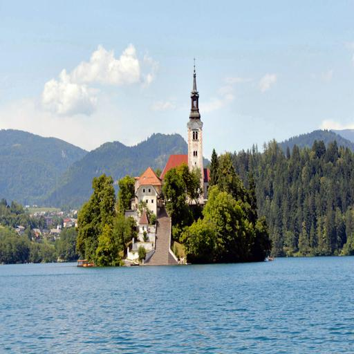 | 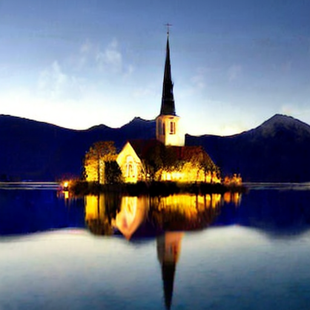 |

### 5. A villa close to the pool → A villa covered with ivy close to the pool

**CLIP:** 0.275

| Source | Edited |
|--------|--------|
| 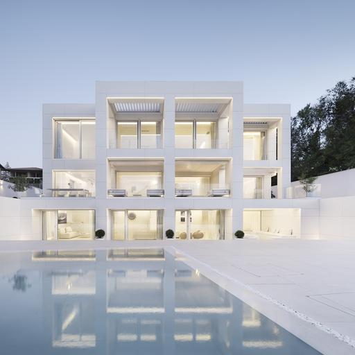 | 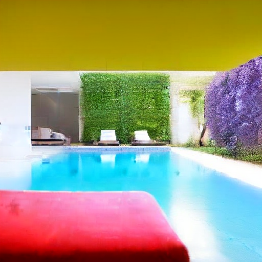 |

### 6. A castle next to a river → A rainbow castle next to a river

**CLIP:** 0.351

| Source | Edited |
|--------|--------|
| 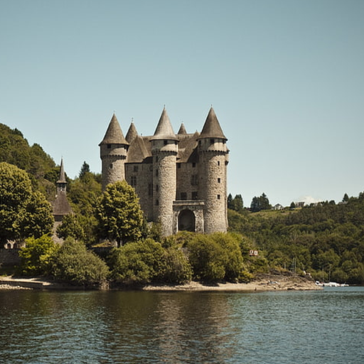 | 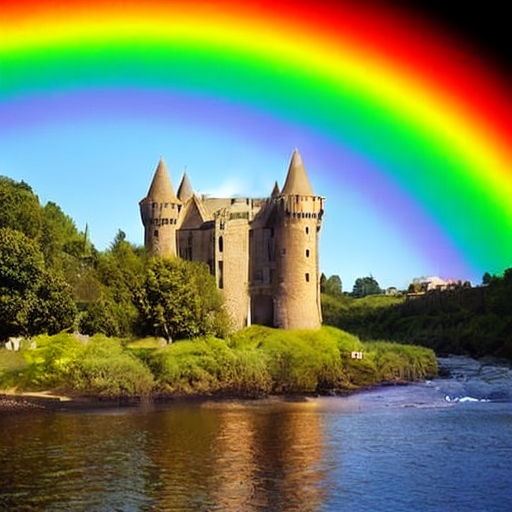 |

### 7. A burger on the table → A burger with lettuce on the table

**CLIP:** 0.291

| Source | Edited |
|--------|--------|
| 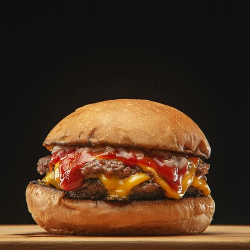 | 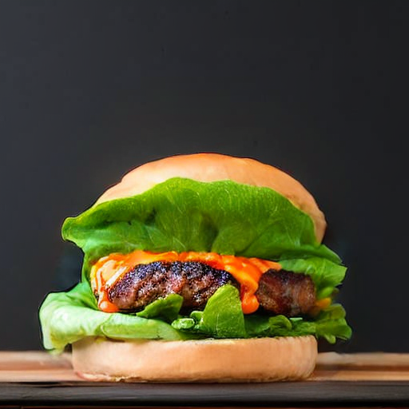 |

### 8. A dog sitting on grass → A golden retriever sitting on grass

**CLIP:** 0.324

| Source | Edited |
|--------|--------|
| 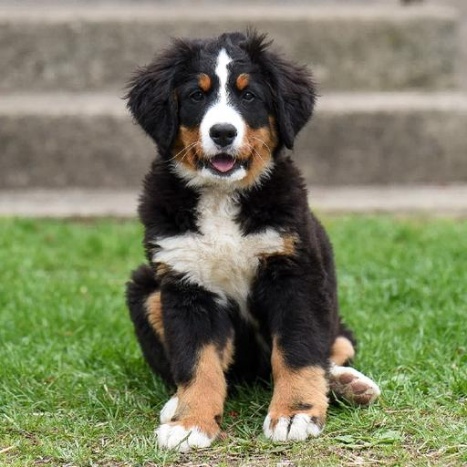 | 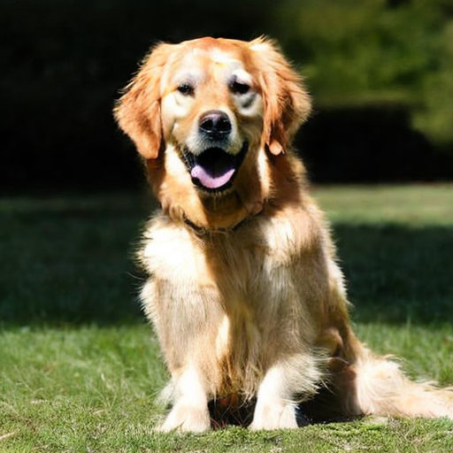 |

### 9. a cat sitting on a table → a wooden cat statue sitting on a table

**CLIP:** 0.373

| Source | Edited |
|--------|--------|
| 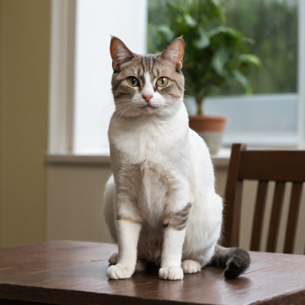 | 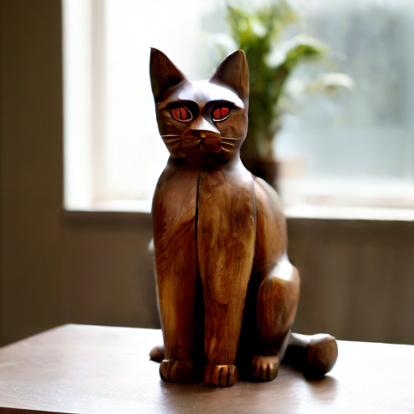 |

### 10. A car on the road → A yellow sportscar on the road

**CLIP:** 0.326

| Source | Edited |
|--------|--------|
| 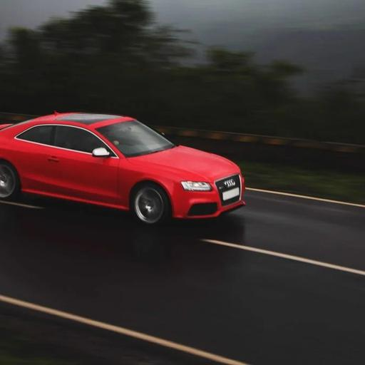 | 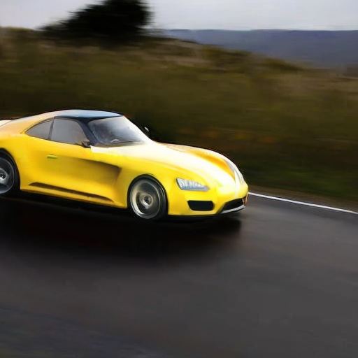 |
